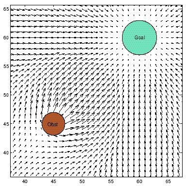
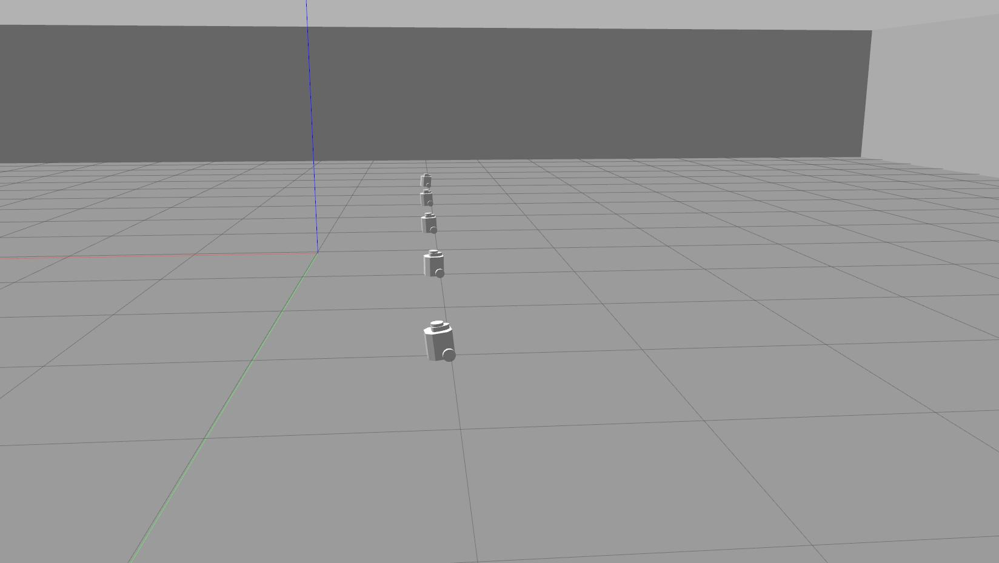
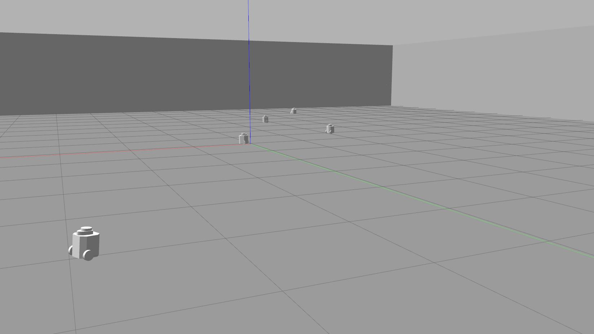

# potential_function

<p align="center">
  
</p>

### Clonning potential_function package to your workspace
```bash
cd ~ros2_ws/src
git clone git@github.com:furkansariyildiz/potential_function.git
```

### Building package
```bash
source /opt/ros/$ROS_ENV/setup.bash
colcon build --symlink-install --packages-select potential_function
```

### Running ros2 potential_function package
```bash
ros2 launch potential_function potential_function.launch.py
```

### Multirobot guideline
https://medium.com/@arshad.mehmood/efficient-deployment-and-operation-of-multiple-turtlebot3-robots-in-gazebos-f72f6a364620


<p align="center">
  
</p>


<p align="center">
  
</p>